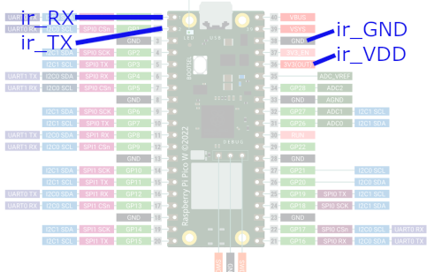

# Project documentation

* Goal: document 
   1. the build chain to get widaktiv-target on current build tools. One build running on the pimorini display (using animations and background picture), the other headless with just one button.
   1. the development of the power meter readout using the pico_w board. Micropython is used for this one


## widaktiv build chain

1. Get pico sdk: https://github.com/raspberrypi/pico-sdk. Tested with repository from 2022-07-26 (more or less release 1.4.0)
1. Get pico examples: https://github.com/raspberrypi/pico-examples Tested with repository from 2022-07-26
1. install latest cmake: download cmake-3.23.2-windows-x86_64.msi from https://cmake.org/download/, run it
1. install gcc for arm: gcc-arm-11.2-2022.02-mingw-w64-i686-arm-none-eabi.exe from arm website: https://developer.arm.com/tools-and-software/open-source-software/developer-tools/gnu-toolchain/downloads. Set the tick to add the path to env. variable
1. install visual studio with C++ development workloads https://visualstudio.microsoft.com/de/downloads/
1. install visual studio code: https://code.visualstudio.com/download and install the extension CMake Tools


## build the targets

1. open developer power shell VS2022
1. cd widaktiv
1. python prepareNmake.py
1. (...follow further instructions given by script)


## power meter readout using pico_w and micropython

1. project folder wireless
1. use micropython to check wireless configuration / server side first (micropython version: 20221006-unstable-v1.19.1, use thonny to run/update code)
   1. server code is in folder RX, needs to be copied to the webserver
   1. simple counter value monitoring to verify internet connection
   1. main.py: working fine, db_update as expected, extended with error handling (LED when not connected and stuff)
   1. serial connection with IR header. NB: pico pins not 5V tolerant, 3.3 only. Use 3.3V supply for IR header (37=3.3V_enable has a pull-up)
     * pin36=3.3V (300 mA recommendation)
     * pin38=GND
     * pin01=TX
     * pin02=RX
1. maybe: use an example from the sdk, switch to c-buildchain instead of micropython
1. TODO: look at picosleep to reduce power consumption [picosleep](https://ghubcoder.github.io/posts/deep-sleeping-the-pico-micropython/)


### Volkszähler info

1. IR-Header: auf [ebay](https://www.ebay.ch/itm/275076138187?hash=item400bd0c4cb:g:VxwAAOSwbkdhxLJL), Sources [bayha-electronics.de](bayha-electronics.de/download/Bauanleitung-TTL.pdf) 
1. UART communication, source [volkszaehler.org](https://wiki.volkszaehler.org/hardware/channels/meters/power/edl-ehz/landisgyr_e350)
   1. 300bd, 7bit, even parity, 1 stoppbit
   1. init sequenz: /?!<CR><LF> (in hex: 2F 3F 21 0D 0A)
   1. answer: /LGZ4ZMF100AC.M23 (means he could communicate with 4.8 kbaud)
   1. need to ack it: <ACK>000<CR><LF> (in hex: 06 30 30 30 0D 0A)
   1. example answer: 
```
/?!\\
/LGZ4ZMF100AC.M23
000
F.F(00)
C.1.0(12314330)
0.0(00188123        )
C.1.1(        )
1.8.1(001234.120*kWh)
1.8.0(001234.120*kWh)
2.8.0(000000.000*kWh)
15.8.0(001234.120*kWh)
C.7.0(0005)
32.7(229*V)
52.7(230*V)
72.7(230*V)
31.7(000.03*A)
51.7(000.04*A)
71.7(000.09*A)
C.5.0(0400)
0.2.0(M23)
16.7(000.00*kW)
```  
1. parameters explained here [e350 data sheet](http://www.smartenergy.com.ua/files/D000027979%20E350%20ZxF100Ax%20Cx%20series%202%20User%20Manual.pdf)
1. use main.py for the pico side
1. TODO: solder documentation, setup pictures


#### Electrical setup

Also connect GP28 to 3V3_EN to save some power (works though without it)


## Sources

* Overview for the C/C++ example: [heise article](https://www.heise.de/developer/artikel/Raspberry-Pi-Pico-und-C-C-eine-gute-Kombination-5991042.html)
* [C/C++ on windows](https://www.element14.com/community/community/raspberry-pi/blog/2021/01/24/working-with-the-raspberry-pi-pico-with-windows)
* [Animations and stuff](http://www.penguintutor.com/programming/picodisplay)
* maybe future ...next step, Tetris on it: [TomsHardware](https://www.tomshardware.com/news/pico-tetris-display-pack-demo)

## Div
* [some possible display for raspi](https://www.heise.de/news/Transparentes-OLED-Display-fuer-Raspberry-und-Arduino-Bastelrechner-7269567.html)

